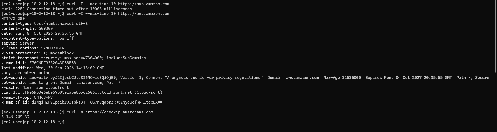

# Lab 3: Private Subnet Internet Access with a NAT Gateway (AWS VPC)

Built a custom VPC from scratch and proved the difference between an isolated private subnet and one that reaches the internet through a NAT Gateway, without ever exposing the instance to inbound traffic.

## Architecture

| Component | Value |
|---|---|
| Region | us-east-2 (Ohio) |
| VPC | `lab3-vpc` 10.2.0.0/16 |
| Public subnets | 10.2.1.0/24 (2a), 10.2.2.0/24 (2b) |
| Private subnets | 10.2.11.0/24 (2a), 10.2.12.0/24 (2b) |
| Internet Gateway | `lab3-igw` |
| NAT Gateway | `lab3-nat` in the public subnet, with an Elastic IP |
| Route tables | `lab3-public-rt` (0.0.0.0/0 to IGW), `lab3-private-rt` (0.0.0.0/0 to NAT) |

**Security groups**
- `lab3-bastion-sg`: SSH (22) from my IP only
- `lab3-private-sg`: SSH (22) from `lab3-bastion-sg` only

**Instances:** a bastion host (public subnet) and a private server (private subnet, no public IP).

## Steps
1. Create the VPC and 4 subnets (2 public, 2 private across 2 AZs)
2. Create and attach the Internet Gateway
3. Public route table with a default route to the IGW; associate the public subnets
4. Security groups (bastion from my IP, private from the bastion SG)
5. Launch the bastion and the private server
6. SSH to the private server through the bastion (ProxyJump)
7. Test internet access, then add a NAT Gateway and a private route table
8. Test again, then clean up

## Result

- **Before NAT:** `curl -I https://aws.amazon.com` timed out after 10 seconds
- **After NAT:** `HTTP/2 200`
- The outbound public IP matched the NAT's Elastic IP, while the private server has no public IP of its own

## Key takeaways
- A subnet is "public" only because of its route to an IGW
- A NAT Gateway gives private instances outbound-only access
- Security group references (SG to SG) are tighter than IP ranges
- NAT Gateways bill by the hour, so clean up right after testing

## Cleanup
Terminated both instances, deleted the NAT Gateway, released the Elastic IP.
