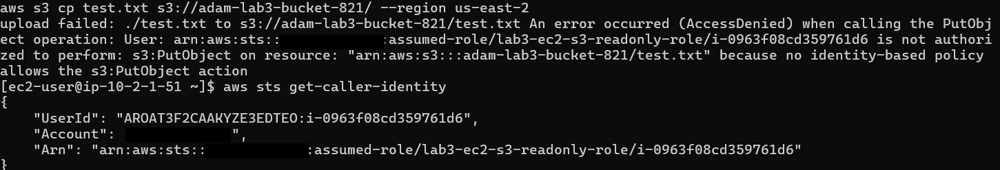

# IAM Role for EC2: Least-Privilege Access to S3 (No Access Keys)

Hands-on AWS lab: give an EC2 instance read-only access to a single S3 bucket using an IAM Role, with no access keys stored on the server.

## Goal

Show how an EC2 instance can call AWS services using temporary credentials from an IAM Role, and prove that permissions are limited to what the policy allows (least privilege).

## Architecture

- Region: us-east-2 (Ohio)
- VPC: `lab3-vpc` (10.2.0.0/16), public subnet `lab3-public-2a`
- EC2: `lab3-bastion` (Amazon Linux 2023, t3.micro), security group `lab3-bastion-sg`
- S3 bucket: `adam-lab3-bucket-821` (Block Public Access enabled) containing `hello.txt`
- IAM Role: `lab3-ec2-s3-readonly-role` attached to the instance through an instance profile

## IAM policy (inline)

Only listing the bucket and reading its objects. No write permissions.

```json
{
  "Version": "2012-10-17",
  "Statement": [
    {
      "Effect": "Allow",
      "Action": "s3:ListBucket",
      "Resource": "arn:aws:s3:::adam-lab3-bucket-821"
    },
    {
      "Effect": "Allow",
      "Action": "s3:GetObject",
      "Resource": "arn:aws:s3:::adam-lab3-bucket-821/*"
    }
  ]
}
```

Trust policy: `ec2.amazonaws.com` is allowed to assume the role (`sts:AssumeRole`).

## Steps

1. Create the S3 bucket in us-east-2 with Block Public Access on, and upload `hello.txt`.
2. Create the IAM Role (trusted entity: AWS service, use case: EC2) with the inline policy above.
3. Launch `lab3-bastion` in the public subnet of `lab3-vpc` and attach the role under Advanced details, IAM instance profile.
4. SSH into the instance and test.

## Tests and results

```bash
# No access keys stored on the server
ls ~/.aws

# List the bucket: works
aws s3 ls s3://adam-lab3-bucket-821 --region us-east-2

# Read the file: works
aws s3 cp s3://adam-lab3-bucket-821/hello.txt - --region us-east-2

# Upload a file: denied, because the role has no s3:PutObject
echo "test" > test.txt
aws s3 cp test.txt s3://adam-lab3-bucket-821/ --region us-east-2

# Show the identity the server is using
aws sts get-caller-identity
```

| Test | Result |
|------|--------|
| `aws s3 ls` | Success, `hello.txt` listed |
| `aws s3 cp` (download) | Success, printed `hello from S3` |
| `aws s3 cp` (upload) | `AccessDenied` on `s3:PutObject` |
| `sts get-caller-identity` | `assumed-role/lab3-ec2-s3-readonly-role/<instance-id>` |



## What I learned

- An IAM Role gives an EC2 instance temporary credentials automatically, so there are no long-lived keys to leak or rotate.
- Scoping the policy to one bucket and only the actions needed enforces least privilege: reading works, writing is denied.
- The instance profile is the link between the role and the EC2 instance.
- The `AccessDenied` message names the exact missing action, which makes troubleshooting policies straightforward.

## Cleanup

Terminated the EC2 instance. The bucket, role and VPC are kept for the next labs (S3 static website, CloudFront).

## Next

- S3 static website with CloudFront
- Bucket policies and encryption
- Infrastructure as code with Terraform / CloudFormation
