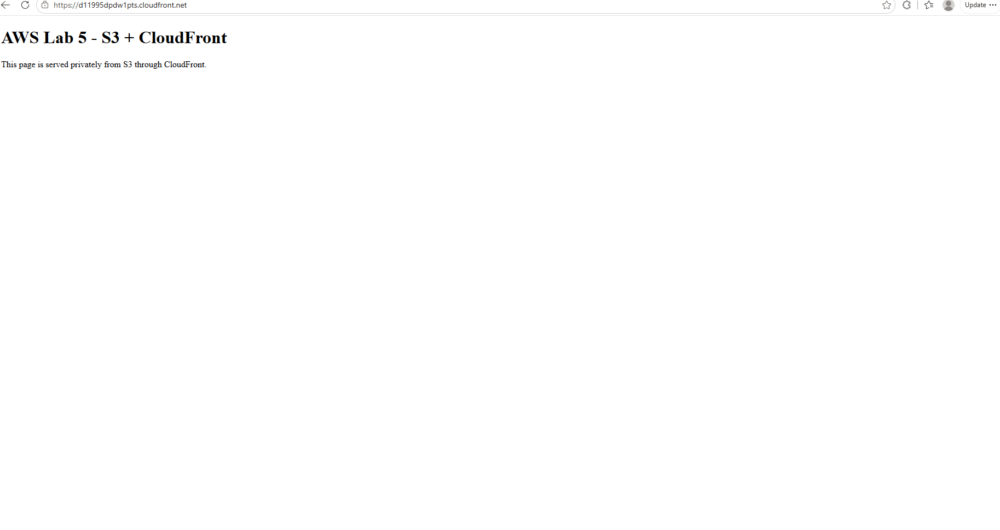
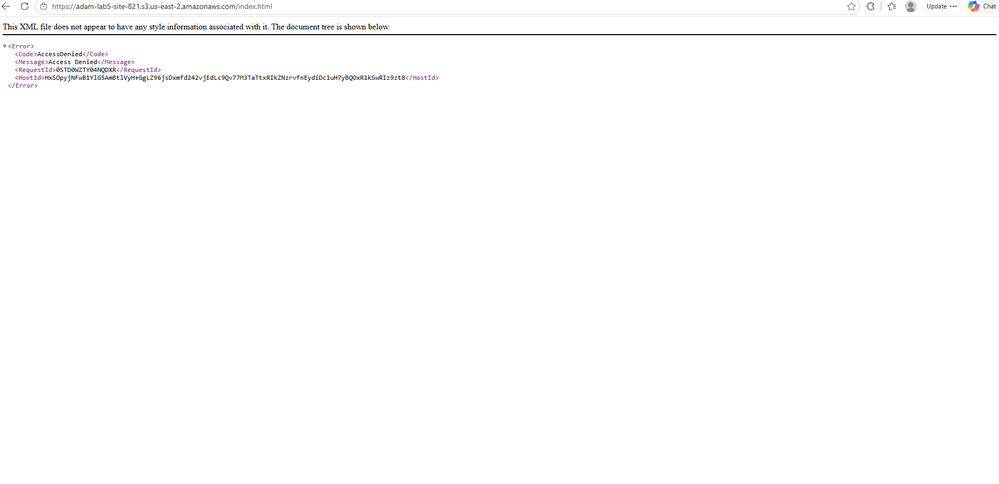

# Lab 5: Private S3 Static Website with CloudFront (OAC)

## Goal
Serve a static website from a **private** S3 bucket through CloudFront, so the content is only reachable via CloudFront and not directly from S3.

## Architecture
User -> CloudFront (HTTPS) -> Origin Access Control (OAC) -> Private S3 bucket

## What I Built
- S3 bucket in us-east-2 with **Block all public access** enabled
- `index.html` uploaded to the bucket
- CloudFront distribution (Free plan) with S3 as the origin
- Origin Access Control (OAC) so only CloudFront can read from the bucket
- Default root object set to `index.html`

## Results
**Through CloudFront: works**

**Direct S3 URL: Access Denied (bucket is private)**

## What I Learned
- A bucket can stay private while still serving a website through CloudFront
- OAC lets CloudFront access the bucket through a bucket policy
- The default root object is needed so the root URL serves `index.html`
- On the Free plan, the pricing plan must be cancelled before the distribution can be deleted

## Cleanup
Disabled the distribution, cancelled the pricing plan, deleted the distribution, then emptied and deleted the S3 bucket.
